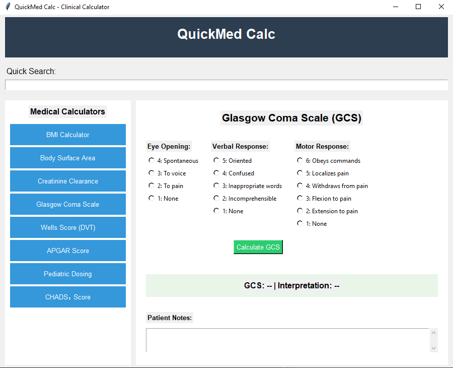

# QuickMed Calc 🏥

> A comprehensive clinical calculator and decision aid tool for medical professionals

[](https://opensource.org/licenses/MIT)
[](https://www.python.org/downloads/)
[](https://github.com/yourusername/QuickMedCalc)

## Overview

QuickMed Calc is a lightweight, offline-capable desktop application designed by and for medical professionals. It consolidates commonly used medical calculators and clinical decision aids into a single, easy-to-use interface.

**Created by a General Physician for real-world clinical use.**

## Features

### 🧮 **Core Medical Calculators**
- **BMI Calculator** - With standard WHO categories
- **Body Surface Area (BSA)** - Mosteller formula
- **Creatinine Clearance** - Cockcroft-Gault equation with staging
- **Glasgow Coma Scale (GCS)** - Complete neurological assessment
- **Wells Score** - DVT risk stratification
- **APGAR Score** - Newborn assessment
- **Pediatric Dosing** - Weight-based medication calculations
- **CHADS₂ Score** - Stroke risk with anticoagulation guidance

### ⚡ **Quick Access Features**
- **Instant Search** - Type "gcs" to find Glasgow Coma Scale
- **Offline Operation** - Works without internet connection
- **Patient Notes** - Built-in note-taking for each calculation
- **Calculation History** - SQLite database stores all results
- **Professional UI** - Clean, medical-appropriate interface

### 💾 **Data Management**
- Local SQLite database for patient notes
- Automatic calculation history
- Export capabilities
- No cloud dependency - your data stays local

## Screenshots


*Main calculator selection interface*


*Glasgow Coma Scale calculator in action*

## Installation

### Option 1: Run from Source (Recommended for Developers)

```bash
# Clone the repository
git clone https://github.com/yourusername/QuickMedCalc.git
cd QuickMedCalc

# Install dependencies (only built-in Python modules required)
pip install -r requirements.txt

# Run the application
python src/main.py
```

### Option 2: Download Executable (Windows)

1. Go to [Releases](https://github.com/yourusername/QuickMedCalc/releases)
2. Download the latest `QuickMedCalc.exe`
3. Run directly - no installation required

### Option 3: Build Your Own Executable

```bash
# Install PyInstaller
pip install pyinstaller

# Build executable
pyinstaller --onefile --windowed --name "QuickMedCalc" src/main.py

# Find executable in dist/ folder
```

## Usage

1. **Launch** the application
2. **Search** for calculators using the search box or browse the list
3. **Select** a calculator from the left panel
4. **Enter** patient data and click calculate
5. **Save** notes if needed - all calculations are automatically stored

### Quick Search Examples
- Type `bmi` → Opens BMI Calculator
- Type `gcs` → Opens Glasgow Coma Scale
- Type `wells` → Opens Wells Score for DVT

## Medical Disclaimer

⚠️ **IMPORTANT MEDICAL DISCLAIMER**

This software is for **educational and reference purposes only**. It is **NOT** intended to replace clinical judgment, professional medical advice, diagnosis, or treatment.

- Always verify calculations independently
- Consult current medical literature and guidelines
- Users are responsible for ensuring accuracy before making clinical decisions
- The authors assume no liability for clinical decisions based on this software

## For Medical Professionals

This tool was created by a practicing General Physician to address real workflow inefficiencies. The calculators included are those most commonly used in daily practice.

### Validation
All formulas have been verified against current medical literature and established clinical guidelines. However, **always double-check critical calculations**.

### Feedback from Clinicians
We welcome feedback from medical professionals to improve accuracy and add relevant calculators.

## Contributing

We welcome contributions from both medical professionals and developers!

### For Medical Professionals
- Report inaccuracies in calculations
- Suggest additional calculators
- Provide clinical feedback on interface design

### For Developers
- See [CONTRIBUTING.md](CONTRIBUTING.md) for technical guidelines
- Follow the existing code structure
- Ensure all medical calculations are properly validated

### How to Contribute
1. Fork the repository
2. Create a feature branch (`git checkout -b feature/new-calculator`)
3. Make your changes
4. Add tests for new calculators
5. Submit a pull request

## Roadmap

### Version 2.0 (Planned)
- [ ] Drug interaction checker
- [ ] Additional scoring systems (APACHE, SOFA)
- [ ] Mobile app version
- [ ] Cloud sync (optional)
- [ ] Multi-language support

### Requested Features
- [ ] Pediatric growth charts
- [ ] Cardiac risk calculators
- [ ] Laboratory value interpretations

## Technical Details

- **Language**: Python 3.7+
- **GUI Framework**: Tkinter (built-in)
- **Database**: SQLite3 (built-in)
- **Dependencies**: Standard Python library only
- **Platform**: Cross-platform (Windows, macOS, Linux)

## License

This project is licensed under the MIT License - see the [LICENSE](LICENSE) file for details.

## Acknowledgments

- Created by practicing medical professionals
- Formulas validated against current medical literature
- Thanks to the medical community for feedback and suggestions

## Support

- 🐛 **Bug Reports**: [GitHub Issues](https://github.com/yourusername/QuickMedCalc/issues)
- 💡 **Feature Requests**: [GitHub Discussions](https://github.com/yourusername/QuickMedCalc/discussions)
- 📧 **Medical Questions**: Please consult your medical literature or colleagues

## Citation

If you use this software in research or education, please cite:

```
QuickMedCalc: Clinical Calculator & Decision Aid Tool
GitHub: https://github.com/yourusername/QuickMedCalc
```

---

**Made with ❤️ by medical professionals, for medical professionals**# QuickMed Calc 🏥

> A comprehensive clinical calculator and decision aid tool for medical professionals

[](https://opensource.org/licenses/MIT)
[](https://www.python.org/downloads/)
[](https://github.com/yourusername/QuickMedCalc)

## Overview

QuickMed Calc is a lightweight, offline-capable desktop application designed by and for medical professionals. It consolidates commonly used medical calculators and clinical decision aids into a single, easy-to-use interface.

**Created by a General Physician for real-world clinical use.**

## Features

### 🧮 **Core Medical Calculators**
- **BMI Calculator** - With standard WHO categories
- **Body Surface Area (BSA)** - Mosteller formula
- **Creatinine Clearance** - Cockcroft-Gault equation with staging
- **Glasgow Coma Scale (GCS)** - Complete neurological assessment
- **Wells Score** - DVT risk stratification
- **APGAR Score** - Newborn assessment
- **Pediatric Dosing** - Weight-based medication calculations
- **CHADS₂ Score** - Stroke risk with anticoagulation guidance

### ⚡ **Quick Access Features**
- **Instant Search** - Type "gcs" to find Glasgow Coma Scale
- **Offline Operation** - Works without internet connection
- **Patient Notes** - Built-in note-taking for each calculation
- **Calculation History** - SQLite database stores all results
- **Professional UI** - Clean, medical-appropriate interface

### 💾 **Data Management**
- Local SQLite database for patient notes
- Automatic calculation history
- Export capabilities
- No cloud dependency - your data stays local

## Screenshots


*Main calculator selection interface*


*Glasgow Coma Scale calculator in action*

## Installation

### Option 1: Run from Source (Recommended for Developers)

```bash
# Clone the repository
git clone https://github.com/yourusername/QuickMedCalc.git
cd QuickMedCalc

# Install dependencies (only built-in Python modules required)
pip install -r requirements.txt

# Run the application
python src/main.py
```

### Option 2: Download Executable (Windows)

1. Go to [Releases](https://github.com/yourusername/QuickMedCalc/releases)
2. Download the latest `QuickMedCalc.exe`
3. Run directly - no installation required

### Option 3: Build Your Own Executable

```bash
# Install PyInstaller
pip install pyinstaller

# Build executable
pyinstaller --onefile --windowed --name "QuickMedCalc" src/main.py

# Find executable in dist/ folder
```

## Usage

1. **Launch** the application
2. **Search** for calculators using the search box or browse the list
3. **Select** a calculator from the left panel
4. **Enter** patient data and click calculate
5. **Save** notes if needed - all calculations are automatically stored

### Quick Search Examples
- Type `bmi` → Opens BMI Calculator
- Type `gcs` → Opens Glasgow Coma Scale
- Type `wells` → Opens Wells Score for DVT

## Medical Disclaimer

⚠️ **IMPORTANT MEDICAL DISCLAIMER**

This software is for **educational and reference purposes only**. It is **NOT** intended to replace clinical judgment, professional medical advice, diagnosis, or treatment.

- Always verify calculations independently
- Consult current medical literature and guidelines
- Users are responsible for ensuring accuracy before making clinical decisions
- The authors assume no liability for clinical decisions based on this software

## For Medical Professionals

This tool was created by a practicing General Physician to address real workflow inefficiencies. The calculators included are those most commonly used in daily practice.

### Validation
All formulas have been verified against current medical literature and established clinical guidelines. However, **always double-check critical calculations**.

### Feedback from Clinicians
We welcome feedback from medical professionals to improve accuracy and add relevant calculators.

## Contributing

We welcome contributions from both medical professionals and developers!

### For Medical Professionals
- Report inaccuracies in calculations
- Suggest additional calculators
- Provide clinical feedback on interface design

### For Developers
- See [CONTRIBUTING.md](CONTRIBUTING.md) for technical guidelines
- Follow the existing code structure
- Ensure all medical calculations are properly validated

### How to Contribute
1. Fork the repository
2. Create a feature branch (`git checkout -b feature/new-calculator`)
3. Make your changes
4. Add tests for new calculators
5. Submit a pull request

## Roadmap

### Version 2.0 (Planned)
- [ ] Drug interaction checker
- [ ] Additional scoring systems (APACHE, SOFA)
- [ ] Mobile app version
- [ ] Cloud sync (optional)
- [ ] Multi-language support

### Requested Features
- [ ] Pediatric growth charts
- [ ] Cardiac risk calculators
- [ ] Laboratory value interpretations

## Technical Details

- **Language**: Python 3.7+
- **GUI Framework**: Tkinter (built-in)
- **Database**: SQLite3 (built-in)
- **Dependencies**: Standard Python library only
- **Platform**: Cross-platform (Windows, macOS, Linux)

## License

This project is licensed under the MIT License - see the [LICENSE](LICENSE) file for details.

## Acknowledgments

- Created by practicing medical professionals
- Formulas validated against current medical literature
- Thanks to the medical community for feedback and suggestions

## Support

- 🐛 **Bug Reports**: [GitHub Issues](https://github.com/yourusername/QuickMedCalc/issues)
- 💡 **Feature Requests**: [GitHub Discussions](https://github.com/yourusername/QuickMedCalc/discussions)
- 📧 **Medical Questions**: Please consult your medical literature or colleagues

## Citation

If you use this software in research or education, please cite:

```
QuickMedCalc: Clinical Calculator & Decision Aid Tool
GitHub: https://github.com/yourusername/QuickMedCalc
```

---

**Made with ❤️ by medical professionals, for medical professionals**